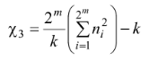
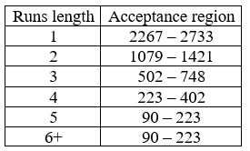

# FIPS140_test

There is an C++ implementation of [FIPS-140](https://en.wikipedia.org/wiki/FIPS_140-3)
used to approve cryptographic modules.

## About

FIPS-140 test includes 4 tests of a 20000 bit long sequence to estimate the randomness of this sequence.

### The Monobit Test

The purpose of the monobit test is to check whether the number of binary '0' and '1' in a
sequence is approximately the same as in a random sequence. A sequence of twenty thousand
bits is considered random if the number of identical bits falls within the range between
9654 and 10346.

### The Maximum runs length Test

A run is defined as sequence of consecutive values of '0' or '1'. The purpose of this test is to find the number of bits in the longest run of '0' and '1' and compare these numbers to the maximum allowed in random sequences. The maximum acceptable length of the series is 36 bits.

### The Poker Test

A 20000 bit sequence is divided into 5000 non-overlapping consecutive 4 bits segments.
The total number of patterns of 4 nits segments is 2<sup>4</sup> = 16. The number of
occurrences of each of the possible 16 patterns is counted.

after this, the counted occurrences are substituted into the formula:

<p align="center">
  
</p>

where *k* - segments quantity, *m* - segments size, *n<sub>i</sub>* - number of occurrence.

According to test, a sequence is considered random if the parameter is in the range between
1.03 and 57.4.

### The runs length Test

The purpose of the test is to check whether the number of '0' and '1' in all
runs of the sequence is the same as in the random sequence. The test counts the number of all runs of bits of length 1, 2, 3, 4, 5, 6+ and check each number, whether it falls into the appropriate interval.

A test sequence is considered random if the numbers of all series fall within the appropriate
intervals according to the following table:

<p align="center">
  
</p>

### Sequence generator

Generator creates 32-bit sequences and paste them to main sequence. After generating 20000 bits,
sequence is ready to tests.

## Example

Example of generating random sequence and test of it using implemented functions:

```C++
uint8_t sequence[2500]{};
sequenceGenerator(sequence);
std::cout << "Generated sequence:\n";
for (uint8_t c : sequence) {
    std::cout << std::setw(2) << std::setfill('0') << std::hex << (int)c;
}
std::cout << "\nThe Monobit Test:\t\t";
if (monobitTest(sequence)) std::cout << "completed\n";
else "failed\n";
std::cout << "The Maximum run length Test:\t";
if (maxRunsLengthTest(sequence)) std::cout << "completed\n";
else " failed\n";
std::cout << "The Poker Test:\t\t\t";
if (pokerTest(sequence)) std::cout << "completed\n";
else "failed\n";
std::cout << "The Runs length Test:\t\t";
if (runsLengthTest(sequence)) std::cout << "completed\n";
else "failed\n";
```
